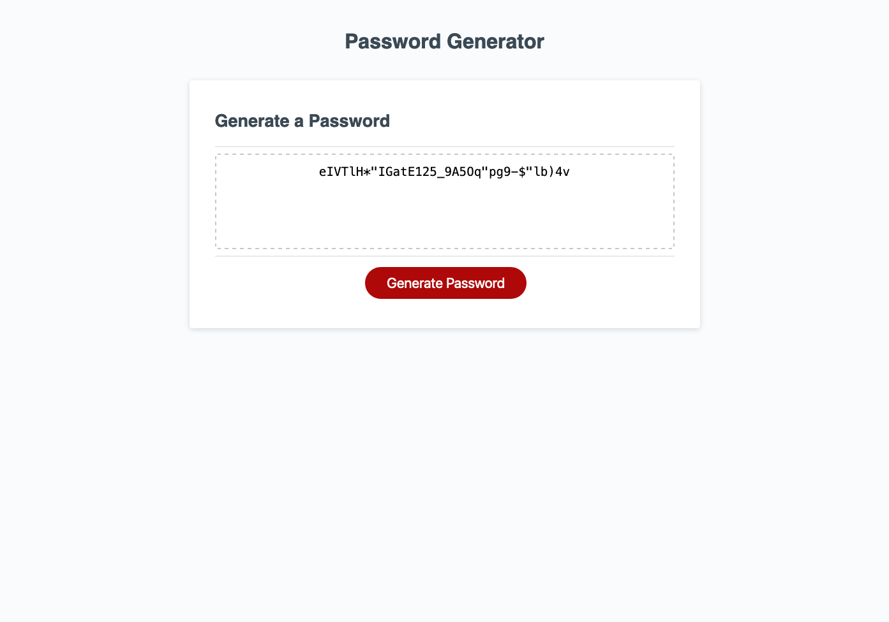

# Password Generator

## Description
This password generator will allow a user to generate a password with a length between 8 and 128 characters. Users can also choose to use lowercase, uppercase, numeric, and/or special characters in their password.

The password generator will prompt the user for their password length and character choices. Invalid choices will result in the user being prompted until they make valid choices.

## Usage
Click the Generate Password button. This will present the user with prompts where they need to input a password length between 8 and 128 characters. Once a valid choice has been made, the user will be presented with subsequent prompts for their character type choices. Clicking "OK" will select the presented character type and clicking "Cancel" will move to the next prompt. At least one character type choice must made or the prompts will repeat.

## Credits
[Daniel Harpin](https://github.com/dharpin) and Chris Miller for helping me bug test and sanity checking my code.

## Live Site
[Password Generator](https://brookescodestuff.github.io/password_generator/)

## Screenshot

